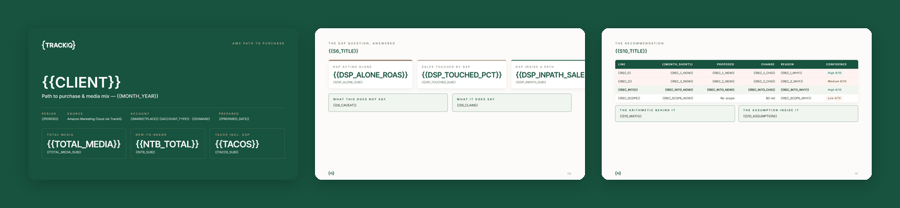

# TrackIQ: Amazon AMC Media Mix

Most Amazon reporting grades execution — is ACoS up, did campaigns spend their
budget, which keyword converted. This asks a different question:

**Given everything spent across Sponsored Products, Brands, Display and DSP,
which combinations of ads actually recruit customers, and what does each
channel cost per new customer?**

That needs Amazon Marketing Cloud, because AMC is the only place you can see
the whole sequence of ad touches before a purchase instead of the last click
that got the credit.

Built as an [Agent Skill](https://code.claude.com/docs/en/skills). Runs in
Claude Code, Claude web, Claude desktop and ChatGPT from the same folder.

---

## Powered by the TrackIQ MCP

[](https://trackiq.com/mcp)

This skill reads your live Amazon account through the
**[TrackIQ MCP](https://trackiq.com/mcp)** — 16 tools connecting your AI
assistant to Amazon data:

Sales & Traffic · Orders · Inventory · Returns · Sponsored Products · Sponsored
Brands · Sponsored Display · Amazon DSP · AMC Cloud · Keywords · Search Terms ·
Targeting · Search Query Performance · Organic Rank · Best Seller Rank · Buy Box
History · Brand Analytics · Export

Works with Claude, ChatGPT and Cursor. **[Get access →](https://trackiq.com/mcp)**

---

## What you get



*Three of twelve slides: the cover, the DSP question with its "what this does
not say" panel, and the recommendation with per-line confidence.*

One self-contained `.html` file — twelve 1920×1080 slides, logos embedded. It
opens in any browser and prints to PDF. Three months pulled from the MCP, built
into an argument across the deck.

**The four things it sees that ordinary reporting can't:**

| | |
|---|---|
| **The touch ladder** | What each additional ad touch does to conversion rate, ROAS and new-customer share — usually more touches sell more, to people already close to buying |
| **What DSP is actually worth** | Its standalone return versus how often it appears in paths that convert. Those two numbers are rarely close |
| **Cost per new customer** | One definition applied across every channel, so Sponsored Products and Sponsored Brands are finally comparable |
| **Time from first touch to purchase** | Which sets both your attribution window and how early to fund a Prime Day |

It ends in a **single reallocation with the arithmetic shown**, netting to zero
unless you asked for a budget change.

## What it deliberately won't say

That a channel *caused* a purchase.

AMC shows co-occurrence in the path, not incrementality — proving causation
needs a holdout test. Slide 6 carries a **"what this does not say"** panel for
exactly that, and any recommendation resting on a causal assumption is scoped
as a re-brief and marked low confidence.

This is the discipline that keeps the deck credible in front of a client. It's
also the easiest thing to get wrong: "DSP drove $X" is a sentence the data does
not support, and the skill refuses to write it.

## Requirements

- The **TrackIQ MCP**, for `get_amc_attribution_paths`, `get_amc_ntb_purchases`,
  `get_amc_time_to_conversion`, `get_account_overview`, `get_dsp_performance`
  and `list_marketplaces`
- **AMC enabled and DSP running** on the account. Without DSP there's no media
  mix to analyse — the weekly recap is the better report.
- Nothing else. No filesystem, no shell, no internet.

**Without the MCP** it works from exported AMC attribution-path, NTB-by-campaign
and time-to-conversion tables plus monthly spend by channel. Slides 3–10 build
from pasted figures, and slide 11 records which pulls were manual.

---

## Install

### Claude Code

```
/plugin marketplace add TrackIQ-HQ/amazon-seller-skills
/plugin install trackiq-amazon-amc-media-mix@trackiq
```

### Claude web, desktop, mobile

1. Download the `.zip` from the
   [latest release](https://github.com/TrackIQ-HQ/trackiq-amazon-amc-media-mix/releases)
2. **Settings → Capabilities → Skills** (code execution must be on)
3. **Create skill → Upload a skill**, choose the `.zip`
4. Toggle it on

### ChatGPT

Same zip. **Plugins → Skills → Create → Upload from your computer.**

---

## Setup

Answers live in `account.md`, copied from
[`assets/account.example.md`](skills/trackiq-amazon-amc-media-mix/assets/account.example.md).
**Every TrackIQ skill reads the same file.**

If you have **several TrackIQ MCPs connected** — different brands behind
identical tool names — the skill calls `list_marketplaces` on each and matches
on the returned name before pulling anything. Getting that wrong builds a
correct deck for the wrong client.

## Delivery

Asked once and stored in `account.md`: **in-chat** (default), **file**,
**Slack**, **n8n** or **email**. Anything leaving the chat confirms with you
first and falls back to in-chat, with a note, when the channel isn't available.

## When to run it

Monthly or quarterly — a QBR, a budget conversation, or "is DSP worth it". It's
the wrong tool for "what happened yesterday"; the daily check-up and weekly
recap cover that.

---

## Customizing

| To change | Edit |
|---|---|
| Brand, marketplace, delivery | `account.md` — no skill edits |
| The pull sequence and its traps | `assets/pulls.md` |
| Every formula, including the reallocation | `assets/derivations.md` |
| What each slide is for, and the voice | `assets/narrative.md` |
| The pre-send checks | `assets/checks.md` |
| The deck shell | `assets/deck-template.html` |

Four rules are load-bearing.

**Never claim a channel caused a purchase.** Write "$X of sales came from paths
containing a DSP impression", never "DSP drove $X".

**One month per NTB call, and check the row count.** It truncates at `limit`
silently — a three-month call at `limit=100` returns 100 rows from the newest
month and nothing from the other two, with no error.

**Never sum AMC rows across months.** Each month is a separate cohort; adding
them double-counts people.

**Measure the footer safe zone, don't eyeball it.** Content must end above
y=976 on all twelve slides. Overflow is invisible in the source and prints the
logo on top of a sentence. `assets/checks.md` has the script; this release
measures clear on all twelve.

---

## Contributing

```bash
python scripts/validate.py    # must exit 0 before any commit
python scripts/build.py       # writes dist/ zip + registry.json
```

Read [AUTHORING.md](https://github.com/TrackIQ-HQ/amazon-seller-skills/blob/main/AUTHORING.md)
before proposing changes.

## License

MIT. See [LICENSE](LICENSE).
